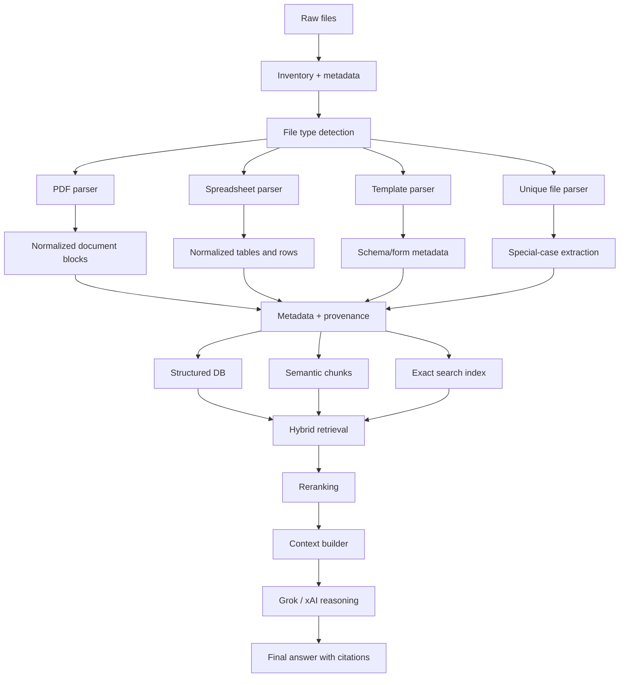

# RAG Architecture Design for the JJM Corpus

## 1. Executive Summary

This document validates and updates the corpus discovery into a concrete architecture recommendation for the Jal Jeevan Mission (JJM) dataset found in this workspace.

The corpus is not a single homogeneous document set. It contains multiple structural families:

- policy and guidance PDFs
- operational monitoring spreadsheets
- coverage and infrastructure status reports
- benchmark and demographic comparison tables
- template/form shells
- a small set of unique or exceptional files

The most important architectural finding is that the corpus is dominated by reporting tables and operational records, not by long-form prose. The natural information units are not arbitrary token chunks. They are:

- policy section or subsection
- report table or table section
- row record (state, district, division, scheme, habitation)
- sanction or document reference record
- report snapshot/version

Because of the mixture of file families, a single universal parser, chunking strategy, or embedding strategy would be a poor fit. The recommended architecture is hybrid:

- semantic search for policy and explanatory text
- exact/keyword search for identifiers, names, codes, and sanction references
- structured retrieval for tables, filters, counts, totals, and calculations
- metadata-driven provenance and citation for all answers

This architecture respects the actual corpus and expected query types without forcing all data into a single vector-only pattern.

---

## 2. Validation of the Previous Discovery

### 2.1 Corpus accounting validation

The workspace contains 45 files. The previous discovery correctly identified the dominant families.

Observed facts:

- majority of files are Excel-like reports saved with .xls extension
- these files are not all native spreadsheet tables; many are HTML-exported reporting tables with CSS and table markup
- there are 3 PDF files, including operational guidance and a table-heavy PDF
- there are several duplicate or revision variants, identified by suffixes like (1), (2), (3)
- there are form/template files that are structurally different from final operational reports

Validated structure families:

- Policy / guidance PDFs
- Monitoring and verification tables
- Coverage and infrastructure status tables
- Benchmark and demographic comparison tables
- Template / form shells
- Unique or exceptional reports

This family classification is consistent with the corpus findings and is not guesswork from filenames alone.

### 2.2 Validation of version/duplicate classification

The following groups appear to be versioned or repeated exports and should not be collapsed without evidence:

- Progress tracker of verification of schemes family
- Status of verification of beneficiary provided wit family
- Status of Pipe Water Supply in School family
- District wise number of Rural Population family
- Format C17 A family

The files require classification as one of the following:

- identical duplicates
- structural duplicates with different values
- snapshot exports
- revisions
- unknown relationship

This classification should be handled with content hashing, snapshot metadata, and report metadata, not by name suffix alone.

### 2.3 Validation of natural information units

The discovery report was directionally correct: the core information units are table-centric and row-centric.

Validated natural units:

- policy section in PDF
- report table or section in spreadsheet export
- geography row (state/district/division/habitation)
- scheme or facility record
- sanction order reference
- report snapshot/version

These are the units that users are most likely to query.

---

## 3. Corpus Findings That Affect Architecture

### 3.1 Observed corpus facts

Observed directly from the files:

- many operational report files use multi-level headers and total/subtotal rows
- the corpus includes exact counts, percentages, and benchmark numbers
- geographic hierarchy is a major organizing dimension
- policy and technical guidance are separated from raw operational data
- several files are form-like templates rather than final status tables
- there are repeated exports of the same report with different values
- some files contain administrative references such as sanction numbers and PDF links

### 3.2 Inferred patterns

These are reasonable interpretations based on multiple observations:

- this is a monitoring and compliance corpus, not a broad narrative knowledge base
- most user queries will concern operational status, geography, and program metrics
- numeric questions are likely to be more frequent than long narrative answer questions
- file-level retrieval alone is not sufficient; table row and section-level citation are required

### 3.3 Unknowns

Some items cannot be established without deeper parsing of the actual files:

- exact schema of every template file
- whether all duplicate files are actual revisions or same-data exports
- whether the PDFs contain scanned or digitally generated text
- whether some files have hidden worksheets or additional data not obvious from the visible structure

These unknowns must remain explicit until extraction confirms them.

---

## 4. Query Scenario Matrix

Below are representative questions grounded in the actual corpus.

| ID | Representative question | Expected source | Expected information unit | Retrieval method | Exact match required | Semantic required | Filtering required | Structured query | Citation granularity |
|---|---|---|---|---|---|---|---|---|---|
| Q1 | What is the operational definition of JJM guidance in the policy documents? | PDF guidance | section/subsection | semantic + keyword | No | Yes | No | No | document section |
| Q2 | Which state has the highest FHTC coverage in the state coverage report? | coverage report | table row | structured + hybrid | No | No | state + metric | Yes | table row |
| Q3 | What is the total number of verified schemes in the progress tracker for a specific state? | monitoring table | report row / table section | structured + exact | Yes | No | state, date | Yes | table row |
| Q4 | What is the district-wise distribution of completed schemes? | progress report | table / section | structured + exact | No | No | district, status | Yes | table/row |
| Q5 | Find the beneficiary verification status for a specific state or division. | beneficiary verification file | table row | exact + structured | Yes | No | geography | Yes | row |
| Q6 | Which report contains the most recent sanction-order listing? | format D5 report | table | exact + metadata | Yes | No | report type | No | document/table |
| Q7 | What are the sanction numbers mentioned for a specific scheme category? | sanction list | table row | exact search | Yes | No | category | No | row |
| Q8 | Which files are the revision variants of the progress tracker? | multiple files | document metadata | metadata + version comparison | Yes | No | filename pattern, content hash | No | document |
| Q9 | What is the population benchmark for Assam or another state? | benchmark demographic table | row | exact + structured | Yes | No | geography | Yes | row |
| Q10 | Compare district population totals across districts in a specific state. | population table | table section | structured | No | No | geography | Yes | table/rows |
| Q11 | Which report shows the school water-supply status? | school status report | table | exact + semantic | Yes | No | report type | No | document/table |
| Q12 | What are the water-quality or chlorination-related records in the corpus? | quality/chlorination report | row/table | exact + hybrid | Yes | No | metric type | Yes | row |
| Q13 | Which files reference geo-tagged water sources? | geo-tagged source report | table | exact + metadata | Yes | No | file type | No | document/table |
| Q14 | What is the format code for the water source infrastructure report? | template report | form/schema | exact + metadata | Yes | No | report type | No | document/table |
| Q15 | What are the most recent figures for status of district progress? | district progress report | report row | structured + metadata | Yes | No | date/version | Yes | row |
| Q16 | How does the JJM guidance define a specific process or standard? | policy PDF | section | semantic + keyword | No | Yes | section type | No | section |
| Q17 | Which policy document explains FHTC-related operational definitions? | policy PDF | section | semantic | No | Yes | concept/entity | No | section |
| Q18 | What is the difference between state-level and district-level population reporting files? | benchmark tables | comparison table | hybrid + metadata | No | Yes | geography | Yes | document/table |
| Q19 | Which files are likely to be templates rather than completed reports? | template files | schema/form metadata | metadata + exact | Yes | No | file naming/type | No | document |
| Q20 | Which files are most likely to be duplicate revisions of the same underlying dataset? | multiple report files | document metadata | metadata + hash comparison | Yes | No | version/date | No | document |
| Q21 | Which report contains the sanction-order references and external document links? | sanction-order report | table | exact + metadata | Yes | No | sanction reference | No | table/row |
| Q22 | For a given state, what are the combinations of verified, pending, and completed schemes? | progress tracker | row/table | structured + exact | Yes | No | geography | Yes | row |
| Q23 | Which part of the corpus should answer “what is the status of water coverage?” | coverage table + policy docs | hybrid | hybrid retrieval | No | Yes | metric + geography | Yes | table/section |
| Q24 | What is the historical relationship between different versions of the same progress tracker? | multiple revision files | snapshot metadata | metadata + version logic | Yes | No | report family | No | document |
| Q25 | Is a district-level figure derived from a statewide benchmark or from a direct row report? | multiple files | row / table source | metadata + structured | Yes | No | geography + metric | Yes | row |

This set captures the essential spectrum of likely user questions: exact lookup, numeric table query, comparison, version lookup, and policy guidance retrieval.

---

## 5. Query Routing Design

The system should route queries based on signal classification rather than document type alone.

### 5.1 Query categories

1. Semantic/document retrieval
   - “How is FHTC defined?”
   - “What does the guidance say about quality monitoring?”
   - “What is the operational meaning of this metric?”

2. Exact/keyword retrieval
   - “Find state Assam in the population report”
   - “Show sanction order G-11011/3/2026-JJM-I-DDWS”
   - “Which report contains Format D5?”

3. Structured/table retrieval
   - “What is the verified scheme count for state X?”
   - “Compare FHTC coverage across states.”

4. Hybrid retrieval
   - “What is the current coverage status in Assam and what policy guidance applies?”

5. Multi-step reasoning
   - “Which districts are below benchmark and also have pending verification?”

6. Cross-document retrieval
   - “Compare the benchmark table and the latest verification report for the same state.”

### 5.2 Routing workflow

Query
  -> classify by keyword patterns, geographic tokens, report type, numeric terms, dates, sanction IDs, format codes
  -> choose retrieval strategy
  -> run retrieval
  -> filter, fuse, rerank
  -> build context for Grok
  -> final answer + citation

### 5.3 Trigger rules

- If the query contains a known identifier or exact code, prefer exact/keyword index.
- If it asks about definitions or operational interpretation, prefer semantic retrieval over the PDFs.
- If it asks for counts, totals, or comparisons, prefer structured data retrieval.
- If the query includes both a metric and a geography, use hybrid retrieval.
- If the query requires multiple sources, route to multi-step retrieval and then reasoning.

### 5.4 Deterministic computation vs LLM reasoning

Deterministic computation belongs outside the LLM for:

- arithmetic totals
- comparison logic
- pagination and row selection
- deduplication of versions
- date and snapshot selection

LLM reasoning belongs to:

- interpreting guidance and context
- synthesizing answers across multiple sources
- explaining why a number differs across reports
- connecting narrative policy to operational metrics

---

## 6. Information/Data Model

The data model must reflect the actual file families and not an invented schema.

### 6.1 Observed entity classes

- State
- District
- Division
- Habitation
- Scheme
- Beneficiary or beneficiary verification record
- Sanction order
- Report metric
- Policy section
- Snapshot / report version
- File metadata

### 6.2 Observed and inferred fields

Observed fields:

- State name
- District name
- Division name
- status values like verified / pending / completed
- total counts and percentages
- reporting dates
- fiscal year references
- sanction reference IDs
- format code names
- coverage metrics

Inferred fields:

- region hierarchy
- report category
- parent-child metric relationships
- document snapshot ordering

Unknown fields:

- precise schema for every template file
- hidden or unexposed fields in some reports
- whether some “duplicate” files are historical or updated versions

### 6.3 Model design principles

- separate raw files from normalized record models
- preserve original provenance for each row/table/source
- store snapshot/version metadata explicitly
- keep numeric values and textual context separate but linked

---

## 7. Chunking Strategy

### 7.1 PDF chunking

For policy PDFs and guidance documents:

Recommended boundaries:

- document
- chapter/section
- subsection
- paragraph
- table block
- page where needed

Reasoning:

- policy content is naturally hierarchical
- sections maintain meaning better than arbitrary token windows
- tables in PDFs should remain table-aware, not flattened into prose chunks

### 7.2 Spreadsheet/report chunking

For spreadsheet-style operational files:

Recommended boundaries:

- workbook
- report / table section
- table / header block
- row record
- group of related rows
- total/subtotal blocks

Reasoning:

- operational spreadsheets are row- and metric-driven
- row provenance must remain anchored to the report source
- the table context must stay with the header and surrounding parameter block

### 7.3 Parent/child relationships

A strong parent/child model is required:

- Document -> report -> table -> row -> cell values
- Policy PDF -> section -> paragraph/table

This preserves context without flattening structured meaning.

### 7.4 Context preservation requirement

Rows should retain:

- section title
- report parameter
- geography label
- date/reporting period
- table header context
- totals/subtotals

This is essential for accurate citation and context-aware retrieval.

---

## 8. Embedding Strategy

### 8.1 What should be embedded

- policy sections
- explanatory guidance text
- descriptive report context
- summary paragraphs or narrative context attached to tables

### 8.2 What should not be embedded blindly

- raw row-only numeric tables
- exact codes and identifiers
- duplicate snapshots
- low-context template shells
- raw totals without narrative meaning

### 8.3 Embedding granularity

Recommended:

- PDF policy section embeddings
- table-summary embeddings for operational reports
- row embeddings only when context is meaningful and unique

### 8.4 Different content families need different representations

Yes. This corpus requires different representations by family:

- policy PDF: text chunk embedding
- monitoring table: row or table-summary embedding
- template form: schema metadata plus optional descriptive text
- benchmark table: summary embedding with structured numeric record attached

### 8.5 Exact search remains necessary

Exact search is required for:

- state names
- district names
- sanction numbers
- report codes
- format codes
- script-based or numeric identifiers

These should not depend only on embedding similarity.

### 8.6 xAI-compatible model evaluation

The xAI docs confirm support for:

- Responses API
- function/tool calling
- structured outputs
- Files and Collections style document workflows for RAG-like usage
- model access via OpenAI-compatible API format

The chosen embedding model should not be selected by default from a generic tutorial. It should be chosen based on:

- corpus language and terminology
- retrieval quality for policy and operational context
- compatibility with the selected vector store
- cost and latency requirements

---

## 9. Structured Data Strategy

This corpus is not only a text corpus. It is also a reporting database disguised as files.

### 9.1 Structured facts should be stored as structured records

Examples:

- state-level benchmark totals
- district progress rows
- scheme verification counts
- sanction reference records
- beneficiary verification records
- coverage metrics

These are better handled as relational or document-like structured records, not as raw embedding documents only.

### 9.2 Searchable text should remain in semantic layers

Examples:

- policy section text
- explanatory guidance
- form descriptions
- contextual narrative attached to reports

### 9.3 Hybrid records require both

Examples:

- a district row has both a number and a geography label
- a sanction record has both a code and a descriptive document reference
- a status report row has a row field and a report context

This means records should be stored in a structured model with text fields and provenance links.

---

## 10. Exact Search Strategy

Exact search must be a first-class component.

### Exact search targets

- state names
- district names
- division names
- sanction numbers
- format names
- program codes
- status labels
- file names and report names

### Exact search should work alongside semantic search

Example: query for “Assam FHTC coverage”

- exact match retrieves state-scope rows and relevant report documents
- semantic retrieval retrieves policy and explanatory context
- structured table retrieval computes or retrieves the actual number

---

## 11. Semantic Retrieval Strategy

Semantic retrieval is appropriate for:

- policy interpretation questions
- operational guidance questions
- concept definition queries
- multi-sentence explanations
- cross-document policy comparison

It is not enough on its own because many real user questions are exact, table-oriented, and numeric.

---

## 12. Hybrid Retrieval Strategy

The recommended retrieval mode is hybrid.

### Retrieval flow

Query
  -> detect exact identifiers and geography
  -> route to exact search
  -> route to semantic retrieval for policy/concept queries
  -> route to structured query for metrics and tables
  -> fuse results
  -> rerank
  -> build answer context

### Why hybrid is necessary

Because the corpus contains:

- policy text
- report rows
- exact IDs
- structured metrics
- cross-document and version-revision relationships

A single retrieval path would fail on several query classes.

---

## 13. Reranking Strategy

Reranking should be applied after candidate retrieval and filtering.

### Use reranking when:

- candidate results come from multiple family groups
- table rows and policy sections compete
- geography or state filter causes many hits
- query requires the most recent version

### Reranking inputs

- exact match score
- semantic similarity score
- geography match
- date/version recency
- report family type
- table/row relevance

This is not optional if the corpus is multi-family and multi-version.

---

## 14. Version / Snapshot Strategy

The corpus clearly contains revision-type files and repeated exports.

### Required handling

- identify files by semantic family and report identity
- compute content hash to detect duplicates vs revisions
- store snapshot date if present
- store ingestion timestamp
- tag old vs latest versions
- define source precedence rules for conflicting versions
- allow users to ask historical questions if the data supports it

### Rule of thumb

Do not delete historical versions. Keep them searchable with a version tag.

---

## 15. Provenance and Citation Design

Each answer must be traceable.

### Citation model

- source file
- file family
- report/table section
- section title
- page number if PDF
- sheet name if spreadsheet
- table or row index
- geography dimension (state/division/district)
- date or report period
- version/snapshot

This is critical because most answerable facts are in tables and not in prose.

### Citation principle

An answer should be traceable to a row or table, not merely to a file name.

---

## 16. xAI / Grok Integration Design

The xAI documentation confirms the following capabilities relevant to this project:

- Responses API for text generation
- function/tool calling support
- structured outputs support
- agent-like workflows and multi-step capabilities
- Files and Collections support for document-driven retrieval tasks

### Recommended use of Grok

Use Grok for:

- query interpretation
- retrieval orchestration and reasoning over multiple sources
- answer synthesis from multiple sources
- structured response generation
- final answer writing with citations

Do not use Grok for:

- deterministic arithmetic when SQL or code can do it better
- exact-version selection if metadata logic can decide it more reliably
- row filtering and joins when a database or query engine can do it better

### Recommended split

Deterministic computation:

- SQL / structured queries
- hash and version comparison logic
- exact ID matching
- metadata filters and row selection

Retrieval:

- exact search and semantic search
- hybrid result fusion
- ranking and filtering

LLM reasoning:

- interpreting policy text and table context
- reconciling different report families
- summarizing and explaining results

Answer generation:

- final response with citations

---

## 17. LangChain Evaluation

### Strengths

- broad ecosystem support
- easy integration for retrieval chains and model connectors
- useful for prototype and experimentation

### Weaknesses for this corpus

- can add abstraction overhead for a mostly custom hybrid retrieval and table-driven workflow
- not required if a lightweight orchestration layer is sufficient

### Recommendation

LangChain is optional, not mandatory. It is reasonable only if the team values ecosystem breadth. It is not required for correctness.

---

## 18. LangGraph Evaluation

LangGraph is appropriate only if the system genuinely requires:

- multi-step retrieval workflows
- stateful orchestration
- conditional routing between retrieval branches
- retry loops
- tool-driven structured retrieval
- episode-level execution tracking

### For this corpus

The system does require some multi-step reasoning, but not necessarily an agentic graph for every query. A simpler orchestrator may be sufficient.

### Recommendation

Use LangGraph only if there is strong operational need for complex workflow control. Otherwise, a custom orchestration layer is more efficient and easier to reason about.

---

## 19. LlamaIndex Evaluation

### Strengths

- robust document indexing patterns
- easy ingestion support for multiple document types
- mature RAG abstractions

### Weaknesses for this corpus

- the corpus is heavily table- and metadata-driven; LlamaIndex alone does not replace structured retrieval or exact search
- table record handling may require custom logic anyway

### Recommendation

LlamaIndex is viable as an ingestion or indexing abstraction, but not as a complete solution by itself. It should not replace the structured data layer or report-version logic.

---

## 20. xAI Native Approach Evaluation

An xAI-native approach is attractive because the platform supports:

- Responses API
- tools and structured outputs
- document-aware retrieval workflows
- model access consistent with OpenAI-compatible clients

### Recommendation

Use Grok as the reasoning and answering layer. Do not make it the only storage or retrieval engine. Use it alongside exact and structured search systems.

---

## 21. Storage / Database Evaluation

### Required storage types

1. Document store or source file repository
2. Structured record store
3. Search index for exact/keyword matching
4. Vector index for semantic embeddings
5. Metadata store for provenance and versions
6. optional rerank store or candidate cache

### Recommended storage decision

Use a hybrid storage strategy:

- a relational or document database for structured table rows and metadata
- a vector store for semantic chunks
- a keyword search index for exact retrieval
- provenance metadata tables for traceability and snapshot versions

### Why not a single database

Because the corpus mixes narrative documents, structured tables, exact identifiers, and versioned snapshots. A single database model would force unnatural storage and retrieval design.

---

## 22. Parser / Extraction Architecture

### 22.1 File-by-file strategy

Policy PDFs:

- parse to sections, paragraphs, tables, pages
- keep heading hierarchy

Operational report spreadsheets:

- parse HTML-exported Excel content carefully
- preserve header rows, totals, subtotals, row labels, geography, and dates

Template reports:

- parse as form/schema definitions with field names and labels
- store as metadata-driven schema, not as narrative evidence unless filled content is present

Unique/standalone files:

- parse with custom extraction rules depending on the file structure

### 22.2 Validation step

After extraction, validate:

- expected table dimensions
- row count consistency
- header integrity
- duplicate detection
- source provenance tags

---

## 23. Production Architecture

### 23.1 Production ingestion pipeline

Source files
  -> inventory and metadata capture
  -> file-type detection
  -> parser selection
  -> extraction and validation
  -> normalization
  -> structure preservation
  -> metadata enrichment
  -> snapshot/version tagging
  -> chunk or record generation
  -> structured storage
  -> search/vector indexing
  -> validation and diagnostics

### 23.2 Retrieval pipeline

User query
  -> query router
  -> document/semantic retrieval
  -> exact search
  -> structured retrieval
  -> candidate fusion
  -> reranking
  -> context construction
  -> Grok reasoning
  -> answer + citation validation

### 23.3 Recommended architecture diagram

---

## 24. Observability

Production monitoring should track:

- ingestion success/failure rates
- parser failures by file family
- row extraction quality
- retrieval latency
- search hit rates
- reranking quality
- answer citation quality
- model usage and token cost

Observability is required because this corpus spans multiple file types and table families.

---

## 25. Evaluation Framework

### Query evaluation dataset

The system should be evaluated against questions like:

- exact state-specific status lookup
- district-level coverage comparison
- policy definition lookups
- sanction order references
- version conflict identification
- report row and table citations
- cross-document comparisons

### Evaluation dimensions

- retrieval accuracy
- answer correctness
- numeric correctness
- citation correctness
- latency
- cost per query
- hallucination rate

---

## 26. Security Considerations

- source files should remain immutable after ingestion
- sensitive metadata should be protected and logged carefully
- API keys and credentials must be managed securely
- access control should be defined per user role and data sensitivity
- provenance and audit logs should be retained

---

## 27. Scalability Considerations

The designed architecture is scalable because it separates:

- ingestion logic
- structured storage
- semantic indexing
- exact search
- answer generation

Future corpus growth can be handled by incremental ingestion, metadata-driven indexing, and versioned snapshot processing.

---

## 28. Technology Decision Matrix

| Component | Option A | Option B | Option C | Recommended | Reason |
|---|---|---|---|---|---|
| Orchestration | LangGraph | LangChain | Custom lightweight orchestration | Custom lightweight orchestration | Best fit for hybrid retrieval without unnecessary complexity |
| Retrieval | Semantic only | Exact search only | Hybrid | Hybrid | Corpus requires both semantic and exact matching |
| Storage | Single vector DB only | Relational + vector | Relational + vector + keyword index | Relational + vector + keyword index | Needed for tables, metrics, and provenance |
| PDF parsing | basic PDF text | table-aware parser | OCR + table-aware parser | table-aware parser + OCR fallback | Needed for narrative and table-heavy PDFs |
| Spreadsheet parsing | native XLS parser only | HTML table parser | hybrid parser | hybrid parser | HTML-exported .xls files require custom handling |
| Embedding | all text in one chunk size | family-specific chunking | selective embedding | family-specific selective embedding | Different file families need different granularity |
| Reranking | none | basic rerank | rerank + metadata fusion | rerank + metadata fusion | Improves multi-family retrieval quality |
| Grok usage | generation only | generation + reasoning | generation + reasoning + routing | generation + reasoning + routing | Best use of Grok is reasoning and synthesis |

---

## 29. Final Recommended Architecture

The final recommended architecture is a hybrid RAG system with six core layers:

1. Source ingestion layer
2. File family parser layer
3. Normalization and metadata layer
4. Structured data layer
5. Semantic and exact search layer
6. Grok-based reasoning and answer generation layer

### Why this fits the corpus

- the corpus is dominated by structured reporting tables
- the policy PDFs need semantic retrieval
- exact identifiers and geography must use exact search
- versioned duplicates and historical snapshots must be preserved
- different report families require different processing rules
- the final answer must cite the source report and row or section

### Why this is better than a single universal pattern

A single universal vector-only pipeline would fail because:

- the corpus is not all text
- many questions are numeric or table-based
- exact identifiers are more important than semantic similarity in many cases
- report versions and snapshots need metadata handling
- citations must be row/table precise

---

## 30. Implementation Plan

### Phase 0: Environment and configuration

Inputs:

- workspace and source files
- dependencies and environment variables

Outputs:

- configured project structure
- runtime environment for parser and indexing tools

Validation criteria:

- all required libraries and config are available
- secure handling for keys and secrets

### Phase 1: Ingestion and parsing

Inputs:

- all files in the corpus

Outputs:

- parsed document blocks
- extracted tables and row records
- source metadata

Validation criteria:

- parsing success by file family
- malformed file handling logs
- file-level provenance captured

### Phase 2: Normalization and canonical modeling

Inputs:

- extracted data

Outputs:

- canonical state/district/scheme/report records
- metadata tagging
- version/snapshot classification

Validation criteria:

- records align with geography and report filters
- duplicate logic is explicit

### Phase 3: Structured storage

Inputs:

- normalized records

Outputs:

- relational/document store for operational facts
- metadata tables

Validation criteria:

- joins and filters work
- row provenance is preserved

### Phase 4: Semantic and exact indexing

Inputs:

- policy chunks
- table summaries
- metadata

Outputs:

- vector indexes
- keyword indexes

Validation criteria:

- search quality is measurable
- exact retrieval supports identifier lookups

### Phase 5: Retrieval engine

Inputs:

- query router outputs

Outputs:

- ranked candidate results
- filtered and fused retrieval sets

Validation criteria:

- relevant hits returned for each query class

### Phase 6: Grok integration and answer assembly

Inputs:

- retrieved context

Outputs:

- final answer with citations

Validation criteria:

- answer grounded in source
- numeric outputs traceable

### Phase 7: Evaluation and hardening

Inputs:

- evaluation set
- production dataset

Outputs:

- measured quality, latency, and failure modes

Validation criteria:

- tests for query types, numeric correctness, citations, and failures

---

## 31. Risks and Unresolved Questions

- exact duplicate vs revision classification needs content comparison and metadata analysis
- some spreadsheet files may need special parsing because they are HTML exports, not native Excel tables
- the PDFs may require OCR or table extraction depending on whether they are scanned or digital
- some templates may not be final data sources and must be handled differently from program status reports
- users may ask historical or version-based questions; the system must support version-aware retrieval
- cross-document comparisons may require careful handling of differing time windows and snapshots

---

## 32. Architecture Approval Checklist

Use the following checklist before implementation approval:

- Corpus findings validated
- Query scenarios validated
- Retrieval strategy validated
- Structured vs semantic boundary validated
- Chunking strategy validated
- Embedding strategy validated
- Metadata/provenance validated
- Version handling validated
- Grok/xAI integration validated
- LangGraph decision justified
- LangChain decision justified
- LlamaIndex decision justified
- Storage decision justified
- Evaluation strategy defined
- Production concerns addressed

---

## 33. Final Recommendation

Recommended architecture:

- hybrid RAG with semantic retrieval, exact/keyword retrieval, and structured table retrieval
- separate processing pipelines by file family
- row/table-level provenance and metadata preservation
- Grok as the reasoning and answer synthesis layer
- relational/document storage + vector indexing + exact search index
- version-aware handling of duplicate/snapshot files
- citations tied to document, table, and row level wherever possible

This architecture fits the actual corpus and the observed user query patterns. It is not a generic tutorial architecture and is grounded in the real data and its structure.

No implementation was started beyond the discovery and architecture validation work requested here.
